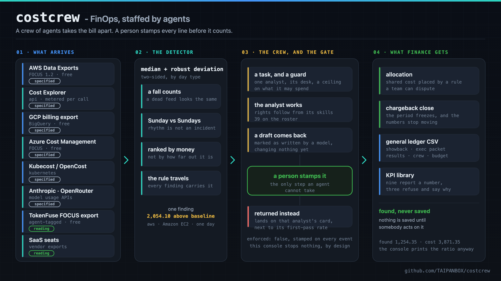
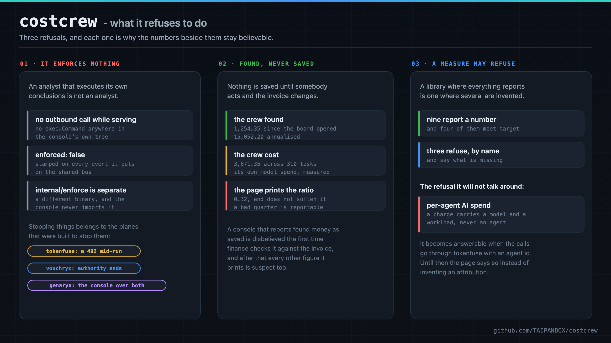
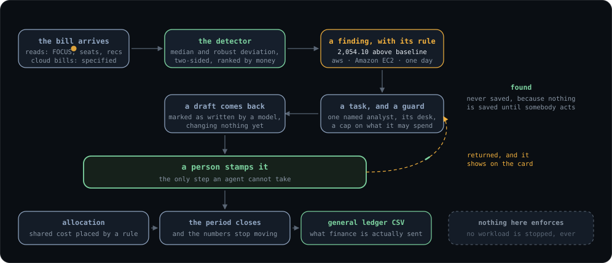
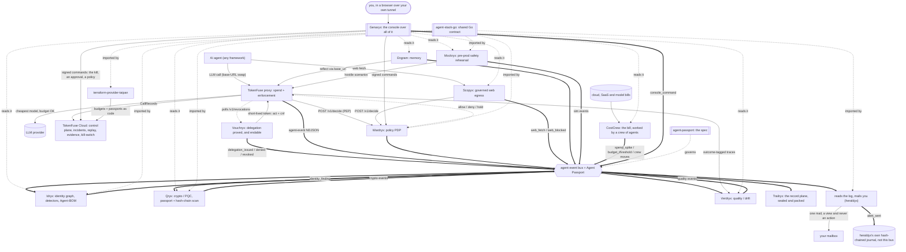

<div align="center">

# costcrew - FinOps, staffed by agents

**A crew of agents takes your bill apart. A person stamps every line before it counts.**

[](https://github.com/TAIPANBOX/costcrew/actions/workflows/ci.yml)




</div>

costcrew is a FinOps console in which a crew of agents does the analysis and a
person reviews it. Analysts are hired into desks with a mission, an owner, rights
that follow from their skills and a monthly guard. They triage anomalies, write
variance commentary, propose rightsizing, draft explainers and freeze forecasts.
Every deliverable arrives as a draft, and only a person's stamp publishes it.

One static binary over pure-Go SQLite. No interpreter, no second database engine
in the process, and **zero JavaScript** in the web UI.

<div align="center">



<sub>The same service as its room on <a href="https://it-rat.com/services/costcrew.html">it-rat.com</a> draws it, where twelve frames of the running console sit beside this.</sub>

</div>

<div align="center">



<sub>The same service as its room on <a href="https://it-rat.com/services/costcrew.html">it-rat.com</a> draws it, lifted from that page so the two cannot drift apart.</sub>

</div>

---

## Where this fits in the stack

CostCrew is the finops plane: it reads the bills the other planes never see, and
it is the one plane in the stack that deliberately cannot stop anything.



- **Consumes**: billing exports and vendor usage APIs, never another service's
  store. Ten connectors: AWS Data Exports (FOCUS 1.2), Cost Explorer, GCP
  BigQuery billing export, Azure Cost Management, Kubecost, OpenCost, Anthropic
  and OpenRouter usage, Compute Optimizer, SaaS seats. Seven built, three
  documented, and every entry declares whether running it is metered per call.
- **Produces**: fifteen event types on the shared agent-event bus, registered in
  `agent-passport` SPEC 6.2 under the source `costcrew`, schema v0.2.
- **Enforces**: nothing. `enforced: false` is stamped on every event, the console
  makes no outbound call while serving a page, and `internal/enforce` is a
  separate binary it never imports.

## The three rules that make the numbers usable

**It enforces nothing, by design.** An analyst that executes its own conclusions
is no longer an analyst. Stopping a runaway is TokenFuse's job, ending an
authority is Vouchryx's, and the console over both is Genaryx.

**Money is found, never saved.** Nothing is saved until somebody acts and the
invoice changes. The seeded estate is blunt about what that means: the crew has
found 1,254.35 and cost 3,871.35 across 310 tasks, and the Results page prints
the ratio without softening it.

**A measure may refuse.** The KPI library reports nine numbers and refuses three,
each refusal naming what is missing. A library where everything reports a number
is one where several of them are invented. The refusal it will not talk around is
per-agent AI spend: a charge carries a model and a workload, never an agent, and
that becomes answerable only when the calls go through TokenFuse with an agent id.

## The detector

A median with a robust deviation rather than a mean, so last month's spike does
not raise the bar for this month. Two-sided, because a feed that stopped
delivering and a workload switched off unnoticed both look exactly like a drop.
A Sunday is judged against Sundays. And findings are ranked by **money**, because
a four sigma deviation worth three dollars is real, true, and not worth anybody's
morning.

## Run it

```sh
go install github.com/TAIPANBOX/costcrew/cmd/costcrew@latest
costcrew -data ./local
```

It listens on `127.0.0.1:8321` and expects a proxy in front of it for TLS. The
first account created at `/signup` becomes the admin of that installation, so
make one before you hand anybody the address.

Inside the stack, `./up.sh --with-finops` from
[stack-up](https://github.com/TAIPANBOX/stack-up) brings it up wired to the
shared bus. Two flags carry the whole integration: `-stack-events` names the
NDJSON file, and the name IS the integration because genaryx keys a read offset
off the stem; `-stack-host` sets the `agent://` authority.

## Cadence

`tools/run -due` takes only cadence-due work, under a ceiling, and refuses
unless a person has turned it on at `/cadence` in the console: the routine
runs when the platform's operator un-suspends it AND the console's switch is
on; either alone spends nothing.

`stack-k8s/manifests/49-costcrew.yaml` ships `costcrew-crew` as a CronJob
with `suspend: true`, and its command line already carries `-live -ceiling
$(COSTCREW_CEILING)`. Once a platform operator un-suspends it, that line
needs `-due` added:

```sh
costcrew-run -data /var/lib/costcrew -due -live -ceiling "$(COSTCREW_CEILING)" \
  -stack-events /var/lib/stack/events/costcrew.ndjson -stack-host "$(TRAILRYX_TRUST_DOMAIN)"
```

stack-single has no routine for the crew today (`@claude` 2026-09-03, read
looking for one per B5-SPEC.md's own instruction: `compose.yaml` names
`costcrew-crew` only as the precedent `idryx-detect`'s own manual-profile
shape was built from, not as a service that exists there). Whenever one is
added, its command line needs the same `-due` addition to whatever args it
otherwise passes `costcrew-run`.

Flipping stack-k8s's `suspend`, or adding a stack-single routine, is a
platform act and a separate decision; neither is done in this repository.

## Gates

```sh
go test ./...                        # 534 tests, 20 packages
./scripts/features-are-bound.sh      # every scenario bound to a named test, both ways
./scripts/gates-have-teeth.sh        # 69 cases: each gate is made to fail on purpose
gofmt -l . && go vet ./...
```

The teeth harness is the one worth knowing about. It plants each gate's own fault
and requires the failure, requires the gate NOT to fire on a non-fault, and
requires it to say it measured nothing rather than reporting OK when its subject
has been taken away.

## The bench

`tools/bench` answers the question a FinOps lead actually asks about a crew of
agents: not how many deliverables it wrote, but how many of them named the
right cause. The generated estate carries the true cause of every planted
driver event, so the bench runs an analyst (or its own deterministic mock
engine, for a test suite that needs no key) on N known anomalies with that
cause hidden from its packet, and prints what fraction named the right
service, day, kind and cause, beside the cost per task:

```sh
go run ./tools/bench -dir ./local -skill triage -engine mock
```

`-live` calls a real model and needs a real key; without it, any engine but
`mock`/`mock-oracle` is priced at that model's own rate and refused, never
called. What it is not: a score on the generated fixture is a score on the
fixture, not a claim about a real production estate, and it says which mode it
ran in (fixture or, on imported data with no planted driver, against the
posted/returned stamp) right in its own header.

## Status

- [x] Rewritten in Go, the Python original deleted 2026-08-25
- [x] Registered producer on the shared bus: every type this console emits is listed under `costcrew` in SPEC 6.2, and estate-gates C4 holds that both ways
- [x] Installed by `stack-up --with-finops`
- [x] Live agents: `tools/run -live` prices the worst case before every call
- [x] An evaluation bench: `tools/bench` scores a named cause against the
      generated fixture's own known answer, or against imported data's stamps
- [ ] Per-agent attribution of AI spend, which needs TokenFuse in the path
- [ ] A console route that starts a crew run; today that is a CLI

## Licence

Apache-2.0, like the rest of the stack. See [LICENSE](./LICENSE).
