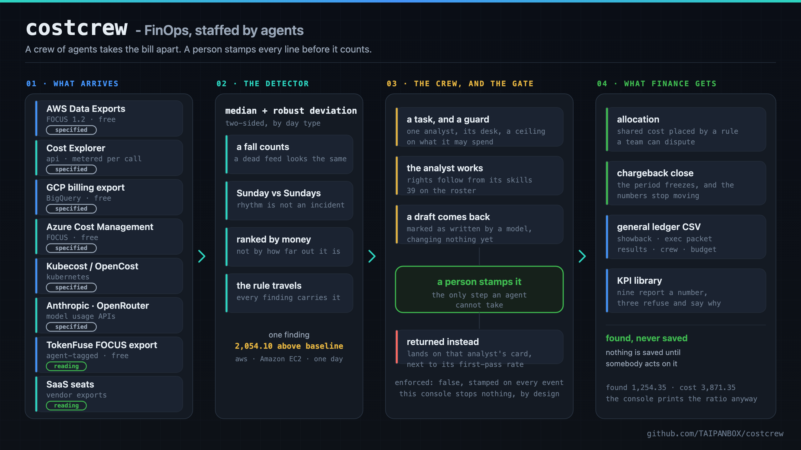
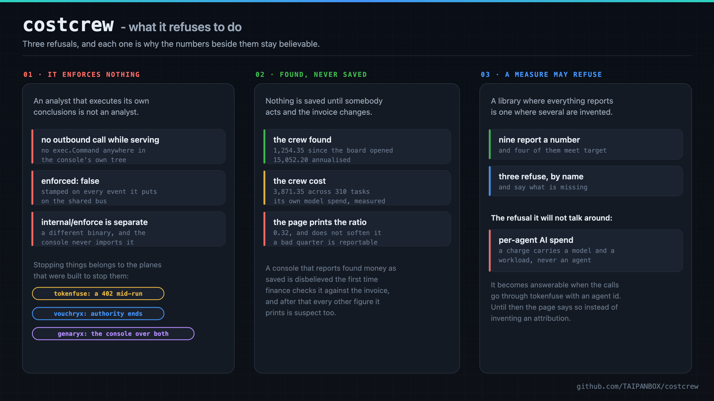
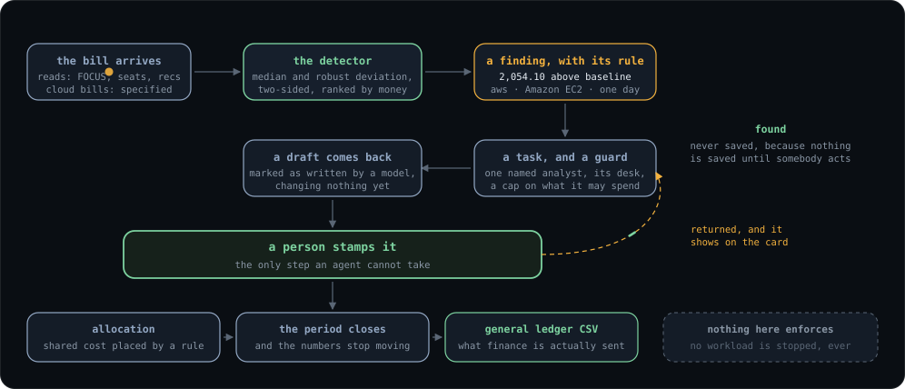
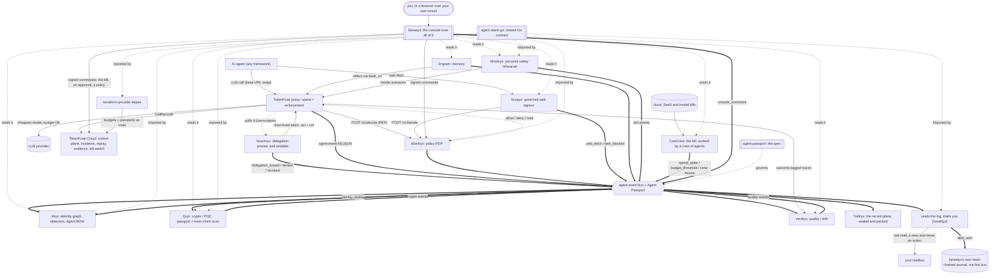

<div align="center">

# costcrew - FinOps, staffed by agents

**A crew of agents takes your bill apart. A person stamps every line before it counts.**

[](https://github.com/TAIPANBOX/costcrew/actions/workflows/ci.yml)




</div>

costcrew is a FinOps console in which a crew of agents does the analysis and a
person reviews it. Analysts are hired into desks with a mission, an owner, rights
that follow from their skills and a monthly guard. They triage anomalies, write
variance commentary, propose rightsizing, draft explainers and freeze forecasts.
Every deliverable arrives as a draft, and only a person's stamp publishes it.

One static binary over pure-Go SQLite. No interpreter, no second database engine
in the process, and **zero JavaScript** in the web UI.

<div align="center">



<sub>The same service as its room on <a href="https://it-rat.com/services/costcrew.html">it-rat.com</a> draws it, where twelve frames of the running console sit beside this.</sub>

</div>

<div align="center">



<sub>The same service as its room on <a href="https://it-rat.com/services/costcrew.html">it-rat.com</a> draws it, lifted from that page so the two cannot drift apart.</sub>

</div>

---

## Where this fits in the stack

CostCrew is the finops plane: it reads the bills the other planes never see, and
it is the one plane in the stack that deliberately cannot stop anything.


```mermaid
flowchart TB
  Agent["AI agent (any framework)"] -->|"LLM call (base-URL swap)"| TF["TokenFuse proxy: spend + enforcement"]
  TF -->|"POST /v1/decide (PEP)"| WX["Wardryx: policy PDP"]
  WX -.->|"allow / deny / hold"| TF
  TF -->|"cheapest model, budget OK"| LLM[("LLM provider")]
  TF -->|"CallRecords"| CL["TokenFuse Cloud: control plane, incidents, replay, evidence, kill-switch"]
  VCX["Vouchryx: delegation proved, and endable"] -->|"short-lived token: act + cnf"| TF
  TF -.->|"polls /v1/revocations"| VCX
  VCX ==>|"delegation_issued / denied / revoked"| BUS
  TF ==>|"agent-event NDJSON"| BUS{{"agent-event bus + Agent Passport"}}
  WX ==> BUS
  Agent -->|"web fetch"| SCX["Scopyx: governed web egress"]
  SCX -->|"POST /v1/decide"| WX
  SCX ==>|"web_fetch / web_blocked"| BUS
  ENG["Engram: memory"] -->|"reflect via base_url"| TF
  ENG ==> BUS
  BUS ==> IDX["Idryx: identity graph, detectors, Agent-BOM"]
  IDX ==>|"identity_finding"| BUS
  BUS ==> QX["Qryx: crypto / PQC, passport + hash-chain scan"]
  QX ==>|"crypto events"| BUS
  BUS ==> VX["Verdryx: quality / drift"]
  VX ==>|"quality events"| BUS
  TF -->|"outcome-tagged traces"| VX
  MX["Mockryx: pre-prod safety rehearsal"] -->|"hostile scenarios"| TF
  MX ==>|"sim events"| BUS
  BILL[("cloud, SaaS and model bills")] --> CC["CostCrew: the bill, worked by a crew of agents"]
  CC ==>|"spend_spike / budget_threshold / crew moves"| BUS
  BUS ==> TRX["Trailryx: the record plane, sealed and packed"]
  BUS ==> HX["reads the log, mails you (heraldyx)"]
  HX -->|"one mail, a view and never an action"| OPS["your mailbox"]
  HX ==>|"alert_sent"| HJ[("heraldyx's own hash-chained journal, not this bus")]
  YOU(["you, in a browser over your own tunnel"]) --> GX[["Genaryx: the console over all of it"]]
  GX -->|"signed commands: the kill, an approval, a policy"| CL
  GX -->|"signed commands"| WX
  GX ==>|"console_command"| BUS
  GX -.->|"reads it"| IDX
  GX -.->|"reads it"| QX
  GX -.->|"reads it"| VX
  GX -.->|"reads it"| MX
  GX -.->|"reads it"| ENG
  GX -.->|"reads it"| SCX
  GX -.->|"reads it"| CC
  TFP["terraform-provider-taipan"] -->|"budgets + passports as code"| CL
  ASG[["agent-stack-go: shared Go contract"]] -.->|imported by| IDX
  ASG -.->|imported by| WX
  ASG -.->|imported by| MX
  ASG -.->|imported by| TFP
  ASG -.->|imported by| HX
  ASG -.->|imported by| QX
  SPEC[["agent-passport: the spec"]] -.->|governs| BUS
```

- **Consumes**: billing exports and vendor usage APIs, never another service's
  store. Seventeen connectors: AWS Data Exports (FOCUS 1.0 and 1.2, read from a
  synced folder), Cost Explorer, GCP billing export (a FOCUS CSV folder
  exported from BigQuery), Azure Cost Management, Kubecost, OpenCost, TokenFuse
  FOCUS export, Anthropic and OpenRouter usage, Compute Optimizer, AWS Cost
  Explorer and GCP Recommender and Azure Advisor rightsizing recommendations,
  AWS Budgets recommended threshold, GCP Cost Recommender and Azure Advisor
  budget-shaped recommendations, SaaS seats. Ten built, seven documented, and
  every entry declares whether running it is metered per call.
- **Produces**: twenty-three event types on the shared agent-event bus, twenty-two
  of them registered in `agent-passport` SPEC 6.2 under the source `costcrew`,
  schema v0.2; the newest, `anomaly_hinted`, is not registered yet.
- **Enforces**: nothing. `enforced: false` is stamped on every event, and
  `internal/enforce` is a separate binary the console never imports. The
  console makes no outbound call while serving a page, with two exceptions:
  the supervisor's plan-ask (`POST /sprint/plan/ask`) calls a model through
  `deliver.Call`, and only when `-gateway` or `-gateway-openai` is set; and
  sign-in through the organisation's identity provider reaches that
  provider's discovery document, keys and token endpoint, and only when
  `-oidc-issuer` is set. At start, and only with `-typryx-url`, it also asks
  typryx for a typed hint about each open anomaly (see below). A test refuses
  any other way for the console to build an outbound request.

## The three rules that make the numbers usable

**It enforces nothing, by design.** An analyst that executes its own conclusions
is no longer an analyst. Stopping a runaway is TokenFuse's job, ending an
authority is Vouchryx's, and the console over both is Genaryx.

**Money is found, never saved.** Nothing is saved until somebody acts and the
invoice changes. The seeded estate is blunt about what that means: the crew has
found 1,254.35 and cost 3,871.35 across 310 tasks, and the Results page prints
the ratio without softening it.

**A measure may refuse.** The KPI library defines twelve measures. On the
generated fixture it reports nine and refuses three, each refusal naming what is
missing: cost per outcome (no business metric is connected), carbon per workload
(no carbon source is connected) and AI spend attributed to an agent. A library
where everything reports a number is one where several of them are invented. The
refusal it will not talk around is per-agent AI spend: a generated charge carries
a model and a workload, never an agent, and that becomes answerable only when the
calls go through TokenFuse with an agent id. Cost per outcome computes once an
import carries tagged outcomes.

## The detector

A median with a robust deviation rather than a mean, so last month's spike does
not raise the bar for this month. Two-sided, because a feed that stopped
delivering and a workload switched off unnoticed both look exactly like a drop.
A Sunday is judged against Sundays. And findings are ranked by **money**, because
a four sigma deviation worth three dollars is real, true, and not worth anybody's
morning.

## A typed hint from typryx, optional

Before an analyst works an anomaly, the console can ask
[typryx](https://github.com/TAIPANBOX/typryx) for a typed hint: which of
`expected_growth`, `runaway_agent`, `misconfiguration`, `price_change` or
`unknown` its `triage.anomaly_class` template picks, and with what
probability. The hint is a suggestion and nothing else. It is shown on the
anomaly page labelled with where it came from, and it goes into the analyst's
packet as something the analyst may disagree with. No option is applied and no
state moves because of it.

| Flag or variable | Meaning |
|---|---|
| `-typryx-url URL` (or `COSTCREW_TYPRYX_URL`) | the typryx to ask, for example `http://127.0.0.1:4320`; empty, the default, asks nothing and changes nothing |
| `COSTCREW_TYPRYX_KEY` (environment only) | sent as `X-Typryx-Key`; never a flag, never logged |
| `-typryx-max-asks N` (console) | ask about at most N open anomalies per start, largest by money first (default 50); an answered one is never asked again |

The console asks after detection, beside the listener, so a slow or absent
typryx never holds the start. `costcrew-run` takes the same `-typryx-url` and
asks only on `-live`, before a task's packet is built; a dry run asks nothing.

**What leaves.** The template decides: the console reads the template's
`fields` from typryx and sends exactly those, chosen from a fixed list (the
anomaly line, the registered changes, desk, service, day, direction, excess)
that holds no team, owner, agent or person. Where they go next is typryx's own
`TYPRYX_BACKEND`, and the hint records which one answered:

| Recorded as | typryx backend | Where the fields went |
|---|---|---|
| `jev` | `jev` | to Jev, hosted by TypeSafe AI, a processor under its own terms |
| `own-model` | `openai-logprobs` | to a model the operator runs, for example Ollama on the same machine |
| `off` | `stub` | nowhere; deterministic and free, not a model's judgement |

A timeout, a refusal or an answer that does not check out is recorded as "no
hint" with the reason, and the page and the packet say so. The bus gets one
`anomaly_hinted` line per ask, naming the backend, the model, the class and its
probability and the names of the fields sent, never their values. With
`-typryx-url` unset the console adds no column and serves exactly the pages and
packets it served before.

How good a hint is depends on the backend, and typryx-evalset measured that on
its frozen 434-question test split (2026-09-30): Jev 87.1% overall and 87.0% on
the triage family, a keyword-rules baseline 82.3%, and `qwen2.5:7b` on a CPU
70.0%. A hint is worth reading, not obeying.

## Run it

```sh
go install github.com/TAIPANBOX/costcrew/cmd/costcrew@latest
costcrew -data ./local
```

It listens on `127.0.0.1:8321` and expects a proxy in front of it for TLS.
Set `-behind-tls` when you do: this process then only ever sees plain HTTP
from that proxy, and without the flag its cookies would never be marked
Secure even though the browser's own connection is HTTPS end to end. The
first account created at `/signup` becomes the admin of that installation, so
make one before you hand anybody the address.

The `costcrew` console accepts `-gateway` for its own planning calls and
`-behind-tls` from `v0.2.1` onward, and `-gateway-openai` (or
`COSTCREW_GATEWAY_OPENAI`), the gateway that fronts the OpenAI wire for an
openrouter engine, from `v0.3.0` onward. The `v0.2.0` image has neither
`-gateway` nor `-behind-tls`: passing `-gateway` to that image exits with
`flag provided but not defined`. The `costcrew-run` binary in `v0.2.0` already
accepts its separate `-gateway` flag. Pin `ghcr.io/taipanbox/costcrew:v0.3.0`
for the console flags and complete release assets.

Inside the stack, `./up.sh --with-finops` from
[stack-up](https://github.com/TAIPANBOX/stack-up) brings it up wired to the
shared bus. Two flags carry the whole integration: `-stack-events` names the
NDJSON file, and the name IS the integration because genaryx keys a read offset
off the stem; `-stack-host` sets the `agent://` authority.

### Sign in through your identity provider

The console can hand sign-in to the organisation's identity provider with
OpenID Connect, so multi-factor authentication and offboarding happen where
the organisation already does them. It is off unless `-oidc-issuer` is set.
Register the console at the provider as a confidential web client whose
redirect URL is the console's own address followed by `/login/oidc/callback`.

| Flag (environment twin) | Meaning |
|---|---|
| `-oidc-issuer` (`COSTCREW_OIDC_ISSUER`) | the issuer URL; https, or http only to a loopback host |
| `-oidc-client-id` (`COSTCREW_OIDC_CLIENT_ID`) | the client id registered at the provider |
| `COSTCREW_OIDC_CLIENT_SECRET`, or `-oidc-client-secret-file` (`COSTCREW_OIDC_CLIENT_SECRET_FILE`) | the client secret; one of the two, never both, and there is no flag for the value, because a flag shows in the process list |
| `-oidc-redirect-url` (`COSTCREW_OIDC_REDIRECT_URL`) | the callback as the browser reaches it, for example `https://costcrew.example/login/oidc/callback` |
| `-oidc-roles` (`COSTCREW_OIDC_ROLES`) | claim values to roles, `finops-viewers=viewer;finops-ops=operator;finops-admins=admin`; entries split on `;` and each at its last `=`, so an LDAP distinguished name works |
| `-oidc-roles-claim` (`COSTCREW_OIDC_ROLES_CLAIM`) | the ID token claim the mapping reads; default `groups` |
| `-oidc-username-claim` (`COSTCREW_OIDC_USERNAME_CLAIM`) | the claim a new account is named after; default `email` |
| `-oidc-scopes` (`COSTCREW_OIDC_SCOPES`) | the scopes requested; default `openid email profile`; add `groups` where the provider needs it asked for |
| `-oidc-only` (`COSTCREW_OIDC_ONLY`) | switch password sign-in off, except for accounts whose password was set with `-set-password` |

What it does, in short. The flow is the authorization code flow with PKCE,
a state bound to the browser and a nonce. The ID token's signature is checked
against the provider's published keys, and its issuer, audience, expiry,
issue time (two minutes of clock skew), nonce and authorized party are all
checked before anything in it is used. The first sign-in creates the account
at the role its group maps to. Every later sign-in applies the role the
mapping gives now, so a change at the provider takes effect at the next
sign-in. A person whose groups map to no role is refused and gets no account:
there is no default role. If such a person still has an account here, every
session it holds ends at that sign-in. While a provider is configured,
`/signup` is closed. With `-oidc-only`, a password signs in only to an
account set from the command line, which is the way back in when the
provider itself is down:

```sh
costcrew -data ./local -set-password 'breakglass:a-long-password-kept-offline'
```

Limits worth knowing before relying on it. A person removed from the group
who never signs in again keeps an open session until it expires (twelve
hours): nothing tells the console about the removal. An account that existed
before the provider was configured is never taken over by an identity with
the same name; remove it first. The groups claim is read from the ID token,
not from the provider's userinfo endpoint. It has been tested against an
identity provider running inside the test suite, not yet against a named
commercial one.

### The other two binaries in the image

The image holds four binaries, all static and run as the same non-root user:
`costcrew` (the console, the entrypoint), `costcrew-run` (the crew's runner),
`costcrew-enforce` and `costcrew-idryxsource`. The last two are not services.
Each runs once, prints, and exits, so a compose file runs them as separate
containers from the same image with the entrypoint replaced, mounting the
console's data directory. Images up to `v0.3.0` carry only the first two; the
first release built after this change carries all four.

`costcrew-enforce` shows what the console's budgets would set on a TokenFuse
control plane and sends nothing unless told to. It is the one binary here that
changes another system, which is why it is a two-step command:

| Flag or variable | Meaning |
|---|---|
| `-data DIR` | the console's data directory (default `.`) |
| `-cloud URL` | the TokenFuse control plane, for example `http://tokenfuse:8791`; required |
| `-period YYYY-MM` | which month's budgets to push; the default is the last closed month |
| `-apply FINGERPRINT` | send exactly the plan that a run without this flag printed with that fingerprint; refuses if the plan has changed since |
| `TOKENFUSE_KEY` (environment) | the control plane's key; required, read from the environment and never written anywhere |

`costcrew-idryxsource` writes the roster as the `agents` source idryx asks for,
so this console's crew appears in the identity graph:

| Flag | Meaning |
|---|---|
| `-data DIR` | the console's data directory (default `.`) |
| `-host NAME` | the `agent://` authority, matching the console's `-stack-host` (default `costcrew.local`) |
| `-out FILE` | where to write the JSON; `-` is stdout (default) |

From a compose file that already runs the console, two services under a
`manual` profile, so `docker compose up` does not start them:

```yaml
services:
  costcrew:
    image: ghcr.io/taipanbox/costcrew:<tag>
    volumes: ["costcrew-data:/var/lib/costcrew"]
    command: ["-data", "/var/lib/costcrew"]

  costcrew-enforce:
    image: ghcr.io/taipanbox/costcrew:<tag>
    profiles: ["manual"]
    entrypoint: ["/usr/local/bin/costcrew-enforce"]
    command: ["-data", "/var/lib/costcrew", "-cloud", "http://tokenfuse:8791"]
    # Add "-apply", "<fingerprint>" to command to send the plan a first run printed.
    environment:
      TOKENFUSE_KEY: ${TOKENFUSE_KEY}   # supplied by the operator's shell or an env file
    volumes: ["costcrew-data:/var/lib/costcrew"]

  costcrew-idryxsource:
    image: ghcr.io/taipanbox/costcrew:<tag>
    profiles: ["manual"]
    entrypoint: ["/usr/local/bin/costcrew-idryxsource"]
    command: ["-data", "/var/lib/costcrew", "-host", "customer.example", "-out", "/var/lib/idryx/sources/agents.json"]
    volumes:
      - costcrew-data:/var/lib/costcrew
      - idryx-sources:/var/lib/idryx/sources   # must be writable by uid 65532

volumes:
  costcrew-data:
  idryx-sources:
```

Run them with `docker compose run --rm costcrew-enforce` (the first run prints
the plan and its fingerprint) and `docker compose run --rm costcrew-idryxsource`.
Without compose, the same thing is `docker run --rm --entrypoint
costcrew-enforce -e TOKENFUSE_KEY -v costcrew-data:/var/lib/costcrew
ghcr.io/taipanbox/costcrew:<tag> -data /var/lib/costcrew -cloud URL`. In
Kubernetes the equivalent is a `Job` or `CronJob` with `command:
["/usr/local/bin/costcrew-enforce"]` and the same arguments. `costcrew-enforce`
exits 2 with a message when `-cloud` or `TOKENFUSE_KEY` is missing, so a
misconfigured job fails loudly instead of doing nothing.

## Verify the image

Images from `v0.2.1` are signed keyless with Sigstore and carry build-provenance
attestations. The `v0.2.2` Release adds SPDX and CycloneDX SBOMs with a
provenance bundle. With `cosign` and `gh` installed:

```sh
cosign verify ghcr.io/taipanbox/costcrew:<tag> \
  --certificate-identity-regexp '^https://github.com/TAIPANBOX/costcrew/\.github/workflows/release\.yml@refs/tags/v' \
  --certificate-oidc-issuer https://token.actions.githubusercontent.com
gh attestation verify oci://ghcr.io/taipanbox/costcrew:<tag> -R TAIPANBOX/costcrew
```

`v0.2.1` is the first signed and attested image, but its Release has no assets
because SBOM generation failed. `v0.2.2` is the first Release with all three
assets. `v0.1.0` and `v0.2.0` predate image signing and attestations.

## Cadence

`tools/run -due` takes only cadence-due work, under a ceiling, and refuses
unless a person has turned it on at `/cadence` in the console: the routine
runs when the platform's operator un-suspends it AND the console's switch is
on; either alone spends nothing.

`stack-k8s/manifests/49-costcrew.yaml` ships `costcrew-crew` as a CronJob
with `suspend: true`, and its command line already carries `-live -ceiling
$(COSTCREW_CEILING)`. Once a platform operator un-suspends it, that line
needs `-due` added:

```sh
costcrew-run -data /var/lib/costcrew -due -live -ceiling "$(COSTCREW_CEILING)" \
  -stack-events /var/lib/stack/events/costcrew.ndjson -stack-host "$(TRAILRYX_TRUST_DOMAIN)"
```

stack-single has no routine for the crew today (`@claude` 2026-09-03, read
looking for one per B5-SPEC.md's own instruction: `compose.yaml` names
`costcrew-crew` only as the precedent `idryx-detect`'s own manual-profile
shape was built from, not as a service that exists there). Whenever one is
added, its command line needs the same `-due` addition to whatever args it
otherwise passes `costcrew-run`.

Flipping stack-k8s's `suspend`, or adding a stack-single routine, is a
platform act and a separate decision; neither is done in this repository.

## Running the crew on a model inside your own network

If billing data may not leave your network, run the crew on a model you host
yourself. The `local` engine calls a server that answers the OpenAI
chat-completions route (`POST /v1/chat/completions`): Ollama, vLLM, LM Studio
and the llama.cpp server all do. Nothing is sent to a vendor, no vendor
address appears anywhere in that route, and no key is needed.

Hire an analyst onto the `local` engine from the hire form, then point the
runner at your server and say which model it serves. With Ollama:

```sh
ollama serve &                       # listens on 127.0.0.1:11434
ollama pull llama3.1:8b

costcrew-run -data ./local -live -engine local -ceiling 1.00 \
  -model-url http://127.0.0.1:11434/v1 \
  -model-name llama3.1:8b \
  -max-run-tokens 400000
```

`-model-url` is the base URL of the server, with its `/v1`; the runner adds
`/chat/completions`. It must be an `http` or `https` address with no password
in it, no query string and no fragment, and the runner refuses it before it
opens anything otherwise. `-model-name` is whatever your server calls the
model. Both fall back to `COSTCREW_MODEL_URL` and `COSTCREW_MODEL_NAME`. Most
self-hosted servers want no key. If yours does, put it in
`COSTCREW_MODEL_KEY`: it is sent as a bearer token and is never printed or
stored.

A model on your own hardware costs no vendor money, but every guard in the
runner counts money, and a reservation of zero never refuses anything. So a
run on the local engine is bounded one of two ways. Price your hardware with
`-local-price-in` and `-local-price-out` (USD per million tokens, whatever
the machine costs you), and the run ceiling and the per-task guards work as
they do for any other engine. Or leave the price at 0 and give
`-max-run-tokens`, a ceiling on the tokens the whole run may use, reserved
before each task the way money is. A run on the local engine at a price of 0
with no token ceiling is refused before the first call. The count is the
server's own. A server that reports no usage is counted at the worst case for
that round, the bytes sent plus the whole output cap, rather than at nothing,
and the runner says so.

If the server is not there, the run stops before the first task with one
line naming the address. No task is blocked for a call that never happened.

To meter these calls like any other, set `-gateway-openai` to a TokenFuse
gateway whose upstream is your server. The runner then sends the call to the
gateway with the usual run and agent headers, and the charge recorded is what
the gateway settled. With only `-gateway` set (the Anthropic wire), a local
task is refused, not sent straight to your server behind the gateway's back.

Each local call is recorded on the shared bus with `price_basis` set to
`local`, so the record says no vendor price was involved. The console's own
supervisor planning call does not run on the local engine yet.

## What a model is shown

The crew's analysts and the supervisor are language models, and what they read
is your bill: team names, service names, money, agent ids, invoice ids,
vendors, commitments, resource ids, the names of the people who answered, past
deliverables, the goal an operator typed. One setting per installation decides
how much of that leaves the process. It is `-prompt-data` on `costcrew` and on
`costcrew-run`, or `COSTCREW_PROMPT_DATA` in the environment, and it takes
three values, spelled exactly. Anything else, a capital letter included,
refuses to start.

`full` is the default and is what this console has always sent. Nothing changes
unless you set something else.

`masked` replaces every name with a stable token before a prompt or a tool
result leaves the process: teams, desks, services, agents, people, invoices,
vendors, products, commitments, resources, models and run ids. A token looks
like `team-7f3a`, and the same name is the same token in every packet, every
tool result and every round of a task, so the model can still tell that two
rows are one team. Money, dates, counts and ratios are real. Text that a person
or a model typed can carry a name the store never held, so it is not scrubbed,
it is left out, with a one-line stand-in saying so: past deliverables, option
summaries and refusal reasons, driver labels, the goal an operator typed, a
mission someone wrote by hand. The two tools whose argument is SQL the model
writes are not offered, because a statement can select any name in a column or
cut one in two, and no scrub of the result can be trusted to recognise half a
name. When the model answers in tokens, the draft is put back into real names
before it is saved, so a person reads real names. A token the model made up
stays as it wrote it.

`aggregates` sends no row at all: per-desk and per-team totals, variances, KPIs
and series sums, with team and desk names masked as above. An anomaly gives its
amount, baseline, z score and day but no service. Drivers, past deliverables,
recommendations, renewals, commitments, per-agent AI spend and invoices are
not sent, and neither is any tool that returns rows.

Whatever the mode, the prompt says which one it was built under, in one line,
and the `tool_call` events and the `crew_ran` summary on the bus carry it as
`prompt_data`, so a run's record says what could have left.

The tokens come from a key kept in your data directory (`prompt-data.key`, mode
0600, made on the first start in a restricting mode). The same key gives the
same tokens on every start; a different key gives different ones, so nobody
without it can test a guessed name against a token. A key file that others can
read, or that is not 64 hex digits, is refused rather than replaced.

What this does not do. It masks the names this installation's store holds, and
nothing else. The working analyst keeps its own name, its role and its job
description, which say which desk it is on. Amounts are real, and an amount can
identify. The gateway still receives the analyst's real agent id in its metering
headers, because that is what it meters. `costcrew-bench` has no such flag and
sends what it always sent. The plan prompt of the console's supervisor follows
the console's setting; the answer is put back into real names before the plan
is checked.

## Measured on a box behind a home router (2026-09-17)

stack-single v1.1.3 ran `ghcr.io/taipanbox/costcrew:v0.2.0` on a Debian 13
mini PC behind a home router, beside a gateway door of its own
(`tokenfuse:v1.0.1`, unit `finops`, attributed by the
`agent://customer.example/*` prefix), `-stack-host customer.example`,
passports with an owner, the console on loopback. First start seeded the
usual fixture estate (about 48,700 rows, 39 analysts).

The crew called a real model through that door. `costcrew-run -live -only
294` under a 0.10 USD cap made one real `claude-sonnet-5` call, settled by
the gateway at 0.05811 USD; two tool calls were refused (`budgets-read` not
granted); then the gateway's own monthly cap answered `402 unit 'finops'
monthly budget exceeded`. Under a 0.004 USD cap, a second task was refused
before any call went through. The gateway wrote `unit_cap_exceeded` (high)
and `breaker_tripped` to its own events file; this console's own
`tool_call` and practice events landed on `costcrew.ndjson`; the notifier
mailed the crew's anomalies with the owner line read from the passport; the
record plane sealed the crew's decisions beside the customer agents' own.

Two defects turned up, both already fixed on `main` and neither in
`v0.2.0`:

- **The runner's own estimate was not the bill.** It printed `Spent 0.0116`
  (its worst case) where the gateway had settled the same call at 0.05811,
  about five times more, because the gateway's price book had no
  `claude-sonnet-5` row and priced it at the fallback rate. Issue #67,
  fixed by #71 (`a91edb8`): the charge recorded is now `x-fuse-cost-usd`,
  the gateway's own settlement, never this repository's own estimate.
- **A FOCUS import that should have replaced the generated estate refused
  itself instead.** `generated_estate_replaced` was journaled with an
  empty severity, outside the shared envelope's closed enum, so the whole
  import rolled back, even though the FOCUS reader had already parsed the
  box's own export cleanly (277 rows, 4 agents, 0.07 total billed cost).
  Issue #66, fixed by #70 (`cb90412`, invariant 50).

Still open at the time of the run: no AWS or GCP billing reader existed, so
the board worked the generated estate and the box's AI spend alone (#68; both
folder readers have since been added). This run used
`v0.2.0`, which predates the console's `-gateway` flag, so the flag was
dropped from the command (#69); closed by `v0.2.1`, the first image that
carries `-gateway`.

**Not proven by this run:** the crew at its ordinary cadence rather than by
hand; a board carrying real cloud bills; the FOCUS import, severity fixed,
run again against a live box. Full detail, rows dated 2026-09-17, in the
estate-gates repository's own PROVEN record:
[github.com/TAIPANBOX/estate-gates](https://github.com/TAIPANBOX/estate-gates).

## Gates

```sh
go test ./...                        # 1050 tests, 20 packages
./scripts/features-are-bound.sh      # every scenario bound to a named test, both ways
./scripts/gates-have-teeth.sh        # 220 cases: each gate is made to fail on purpose
gofmt -l . && go vet ./...
```

The teeth harness is the one worth knowing about. It plants each gate's own fault
and requires the failure, requires the gate NOT to fire on a non-fault, and
requires it to say it measured nothing rather than reporting OK when its subject
has been taken away.

## The bench

`tools/bench` answers the question a FinOps lead actually asks about a crew of
agents: not how many deliverables it wrote, but how many of them named the
right cause. The generated estate carries the true cause of every planted
driver event, so the bench runs an analyst (or its own deterministic mock
engine, for a test suite that needs no key) on N known anomalies with that
cause hidden from its packet, and prints what fraction named the right
service, day, kind and cause, beside the cost per task:

```sh
go run ./tools/bench -dir ./local -skill triage -engine mock
```

`-live` calls a real model, needs a real key, and needs a gateway that fronts
the engine's wire (`-gateway` for anthropic, `-gateway-openai` for openrouter)
and `-stack-host` together: the bench's spend is metered through TokenFuse
exactly like the crew's, the same one call path `tools/run` uses
(`internal/deliver.Call`), and the agent id it is filed under must name this
installation's own trust domain rather than the bare package default.
Without `-live`,
any engine but `mock`/`mock-oracle` is priced at that model's own rate and
refused, never called. What it is not: a score on the generated fixture is a
score on the fixture, not a claim about a real production estate, and it
says which mode it ran in (fixture or, on imported data with no planted
driver, against the posted/returned stamp) right in its own header.

## Status

- [x] Rewritten in Go, the Python original deleted 2026-08-25
- [x] Registered producer on the shared bus: every type this console emits is listed under `costcrew` in SPEC 6.2, and estate-gates C4 holds that both ways
- [x] Installed by `stack-up --with-finops`
- [x] Live agents: `tools/run -live` prices the worst case before every call
- [x] An evaluation bench: `tools/bench` scores a named cause against the
      generated fixture's own known answer, or against imported data's stamps
- [x] Per-agent attribution of AI spend, through TokenFuse: `tools/run` (B6)
      and `tools/bench -live` (B6b) now share the one call path in
      `internal/deliver.Call`
- [ ] A console route that starts a crew run; today that is a CLI

## Licence

Apache-2.0, like the rest of the stack. See [LICENSE](./LICENSE).
